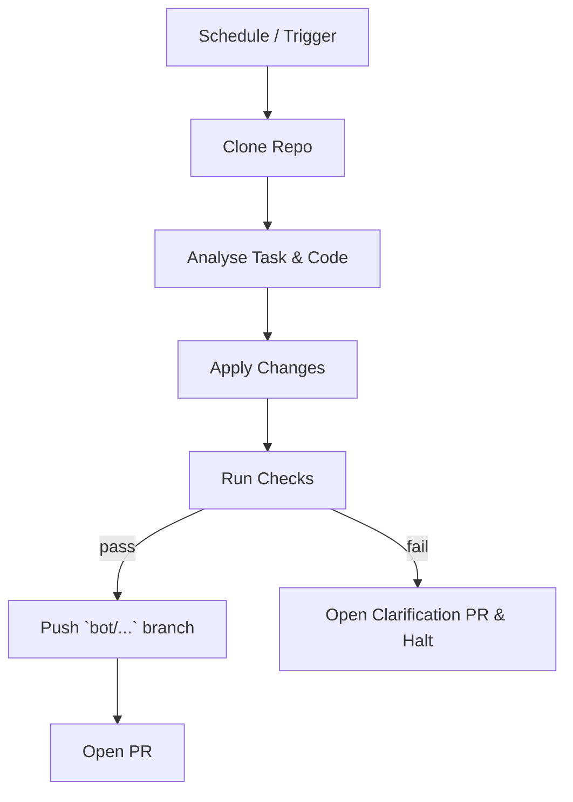

# AGENTS.md — Automated‑Maintenance **Rule Set**

This document is an *executable specification* for any **LLM / Codex‑style autonomous agent** that is authorised to push branches and open **standard pull‑requests (PRs)** against the `2006Scape` repository. The rules below are *strict*; the agent must follow them literally or abort.

> **TL;DR** – If you are an LLM acting on this repo, obey every **MUST**, **SHOULD**, and **MUST NOT** below. If anything is unclear, **pause execution and ask the maintainer directly in the sandbox conversation** (stdout). **Do NOT open Issues or clarification PRs.**

---

## 0  Glossary

| Term      | Meaning                                                  |
| --------- | -------------------------------------------------------- |
| **Agent** | The autonomous program driven by an LLM ("you").         |
| **Task**  | A single logical change (e.g. format refactor, bug fix). |
| **PR**    | A normal GitHub pull‑request created by the agent.       |
| **Tick**  | One full run of the repository GitHub Action workflow.   |

---

## 1  Identity & Meta‑data

* The agent **MUST** identify itself with the commit/author `RuneBot <runebot@users.noreply.github.com>`.
* Each PR **MUST** carry the label `bot`. The agent **MUST** set this label.
* The agent **MUST NOT** push directly to `main`; use a topic branch prefixed `bot/<task>/`.

Example branch: `bot/refactor/player-enums`.

---

## 2  Allowed Operations

The agent **MAY** perform **only** the following categories:

1. **Formatting** – run `google-java-format` through `mvn spotless:apply` **locally** before committing.
2. **Refactor** – behaviour‑preserving changes (e.g. split 6 k‑line classes, extract methods).
3. **Bug‑fix** – fix a reproducible defect referenced in the PR body.
4. **Dependency update** – bump Maven or Docker images **within the same major version**.
5. **CI / workflow** – patch `.github/workflows/*.yml` for build health.

Any other class of change **MUST** be expressly permitted by a maintainer comment containing `/allow‑bot <task>` on the **PR** itself.

The agent **MUST NOT**:

* Touch any file under `cache/` or `assets/`.
* Commit Jagex‑owned proprietary content.
* Re‑write git history.
* Modify license headers.
* Introduce new runtime dependencies without maintainer permission.

---

## 3  Pre‑flight Checklist

The sandbox provides **no Maven or Gradle**, only a plain JDK. The sequence below is the **only supported path**; deviating will crash the CI container and waste resources.

1. **Compilation (warnings‑only)** – must exit 0 even if warnings print:

   ```bash
   git ls-files '2006Scape Client/src/main/java/*.java' -z | xargs -0 javac
   ```
2. **Static‑analysis** – *temporarily disabled* (SpotBugs requires Maven and is unavailable in the sandbox).
3. **Scope limits** – net line‑count change < 10 000 **and** touched files ≤ 20.
4. **Rebase** – branch is rebased onto the latest `main`.
5. **PR Template** – description follows `.github/PULL_REQUEST_TEMPLATE/bot.md`.

If **any** item fails, the agent **MUST** stop further git operations and ask the maintainer a clarification question in the interactive session before retrying.

---

## 4  Commit Message Format

Every commit **MUST** be a single‑line summary ≤ 72 chars starting with `[BOT]`:

```
[BOT] chore(format): apply spotless to Player and Npc packages
```

If more detail is needed, use the PR body – not extra commit lines.

---

## 5  Code‑Style Canon

* Java 17 source/target.
* `google-java-format` (via Spotless) is the single source of truth.
* Max line length = 120.
* Prefer `enum` over magic int constants.
* No new global `static` mutable state.

Violating style **MUST** cause the agent to abort or open a clarification PR.

---

## 6  Refactor Heuristics

An automated refactor **SHOULD**:

1. \*\*Detect and split \*\****god files*** – any class or source file larger than 2 000 LOC **MUST** be broken into smaller, single‑responsibility units in successive PRs that each satisfy Section 3 limits.
2. Remove unused imports & dead code.
3. Convert duplicated literal IDs to shared enums/records.
4. Migrate legacy collections (`Vector`, `Hashtable`) to modern ones.
5. Preserve public API surface; mark breaking‑change PRs with `⚠️ breaking‑change` in the title.

---

## 7  Testing Rules

* New logic **MUST** be covered by JUnit 5 tests stored in the offline test jar (`tests-all.jar`).
* Tests **MUST NOT** rely on an external DB; use in‑memory fakes.
* Each test class name **MUST** end with `Test`.
* The agent **SHOULD** generate property‑based tests when refactoring numerical formulas.

---

## 8  Security & Compliance

* Dependencies **MUST** have no critical CVEs (offline DB).
* Secrets detection (`trufflehog` offline) **MUST** pass.
* The agent **MUST** refuse to commit any file whose SHA‑256 matches the deny‑list in `.github/bot-denylist.txt`.

---

## 9  Rollback / Revert Protocol

If a PR authored by the agent is merged and afterwards fails on `main`:

1. The agent **MUST** open a **revert PR** within one tick.
2. Title format: `Revert: <original‑PR‑title>`.
3. Include a link to the failing CI run in the PR description.

---

## 10  Escalation Workflow

When the agent encounters ambiguity or cannot meet the checklist requirements:

1. **Emit a question** to stdout/stderr prefixed with `[BOT‑QUESTION]`, clearly describing the obstacle or decision point.
2. **Wait** for the maintainer to answer in the same interactive conversation.
3. Proceed only after receiving an answer that resolves the ambiguity.

The agent **MUST NOT** create Issues, extra branches, or PRs for clarification.

---

## 11  Self‑Update  Self‑Update

The agent may update its own workflow **only** via a dedicated PR labeled `bot/self‑update` and must mention a human reviewer.

---

## 12  Lifecycle of a Typical Bot Change



---

## 13  De‑obfuscation & Safe Renaming

Badly named identifiers such as `class204`, `method321`, or `anInt545` **MAY** be renamed **only** under these constraints (even a tiny logic tweak can break client↔server protocol synchronisation):

| Step                         | Mandatory Checks                                                                                                                                    |
| ---------------------------- | --------------------------------------------------------------------------------------------------------------------------------------------------- |
| **1  Scope**                 | Operate on **one top‑level class per PR**. Branch `bot/rename/<old>-to-<new>`; PR title `[BOT] refactor(rename): <OldName> → <NewName>`.            |
| **2  Dependency sweep**      | Grep for the old identifier repo‑wide; update **every reference** that calls the renamed public API. Avoid touching unrelated logic.                |
| **3  No‑logic guarantee**    | Compile using the command in Section 3 and run `tests-all.jar`. The byte‑code diff **MUST** show identifier changes only (verified by `japicmp`).   |
| **4  Triple‑check protocol** | a. Diff‑filter rejects logic changes.b. Compile succeeds.c. Runtime sanity: launch Docker world, log in, run `/skills`, logout; abort on any error. |
| **5  Naming convention**     | Classes `UpperCamelCase`; methods & fields `lowerCamelCase`; names **MUST** convey intent.                                                          |
| **6  Follow‑up classes**     | If class *B* depends on renamed class *A*, update *B's references* in the same PR, but rename *B* itself in a future PR.                            |
| **7  Review artefacts**      | PR body \*\*M                                                                                                                                       |
