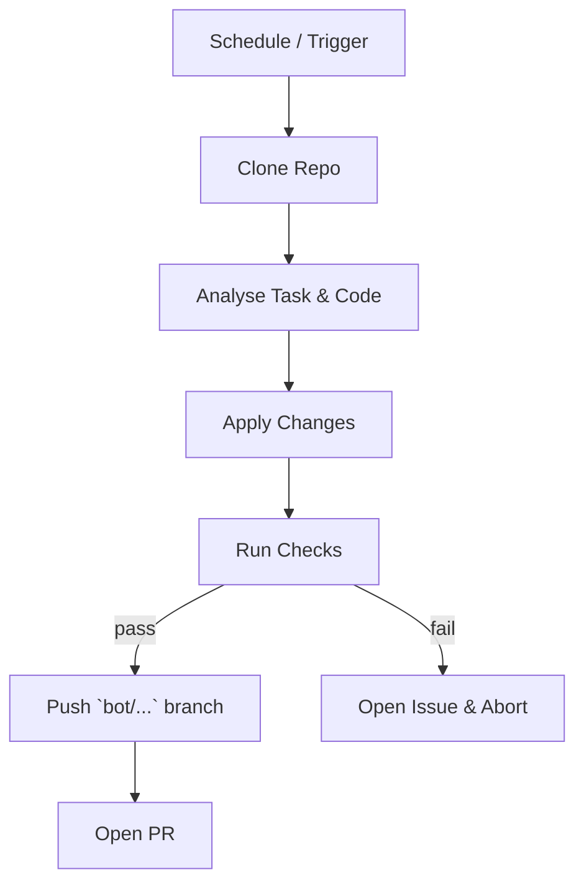

# AGENTS.md — Automated‑Maintenance **Rule Set**

This file is **not** a human‑oriented README.  It is an *executable specification* for any **LLM / Codex‑style autonomous agent** that is authorised to push branches or open pull‑requests against the `2006Scape` repository.  The rules below are *strict*; the agent must follow them literally or abort.

> **TL;DR** – If you are an LLM acting on this repo, obey every MUST, SHOULD, and MUST NOT below.  When in doubt, open an Issue titled `AI‑Clarification: <topic>` and wait for a maintainer.

---

## 0  Glossary

| Term        | Meaning                                                  |
| ----------- | -------------------------------------------------------- |
| **Agent**   | The autonomous program driven by an LLM ("you").         |
| **Task**    | A single logical change (e.g. format refactor, bug fix). |
| **MR / PR** | Merge‑request / pull‑request created by the agent.       |
| **Tick**    | One full run of the repository GitHub Action workflow.   |

---

## 1  Identity & Meta‑data

- The agent **MUST** identify itself with the commit/author `RuneBot <runebot@users.noreply.github.com>`.
- Each PR **MUST** carry the label `bot`.  The agent **MUST** set this label.
- The agent **MUST NOT** push directly to `main`; use a topic branch prefixed `bot/<task>/`.

Example branch: `bot/refactor/player-enums`.

---

## 2  Allowed Operations

The agent **MAY** perform **only** the following categories:

1. **Formatting** – run `mvn spotless:apply`.
2. **Refactor** – pure behaviour‑preserving changes (e.g. split 6k‑line classes, extract methods).
3. **Bug‑fix** – change that closes a GitHub issue with the `bug` label and reproduces in tests.
4. **Dependency update** – bump Maven or Docker base images **within same major version**.
5. **CI / workflow** – patch `.github/workflows/*.yml` for build health.

Any other class of change **MUST** be gated by a maintainer **Issue comment** containing `/allow-bot <task>`.

The agent **MUST NOT**:

- Touch any file under `cache/` or `assets/`.
- Commit Jagex‑owned proprietary content.
- Re‑write git history.
- Modify license headers.
- Introduce new runtime dependencies without maintainer permission.

---

## 3  Pre‑flight Checklist

Before opening a PR the agent **MUST** ensure:

1. `mvn -B verify` exits with status 0.
2. `spotbugs:check` passes.
3. Modified lines are ≥ 80 % covered by unit/integration tests (Jacoco report).
4. Net line‑count change < 5 000 and touched files ≤ 10.
5. Branch is rebased onto latest `main`.
6. PR description follows the **template** in `.github/PULL_REQUEST_TEMPLATE/bot.md`.

If any item fails, abort and open an Issue instead of a PR.

---

## 4  Commit Message Format

Every commit **MUST** be single‑line summary ≤ 72 chars starting with `[BOT]`:

```
[BOT] chore(format): apply spotless to Player and Npc packages
```

If more detail is needed, use the PR body – not extra commit lines.

---

## 5  Code‑Style Canon

- Java 17 source/target.
- `google-java-format` (as configured by Spotless plugin) is the single source of truth.
- Max line length = 120.
- Prefer `enum` over magic int constants.
- No new global `static` mutable state.

Violating style **MUST** cause the agent to fail the pre‑flight build and abort.

---

## 6  Refactor Heuristics

An automated refactor **SHOULD**:

1. Split any class > 2 000 LOC.
2. Remove unused imports & dead code.
3. Convert duplicated literal IDs to shared enums/records.
4. Migrate legacy collections (`Vector`, `Hashtable`) to modern ones.
5. Preserve public API surface; mark breaking change PRs with `⚠️ breaking-change` in the title.

---

## 7  Testing Rules

- New logic **MUST** be accompanied by JUnit 5 tests.
- Tests **MUST NOT** depend on an external DB; use in‑memory Fakes.
- Each test class name **MUST** end with `Test`.
- The agent **SHOULD** generate property‑based tests when refactoring numerical formulas.

---

## 8  Security & Compliance

- Dependencies **MUST** have no known critical CVEs (`mvn org.owasp:dependency-check-maven:check`).
- Secrets detection (`trufflehog`) **MUST** pass.
- The agent **MUST** refuse to commit any file whose SHA‑256 matches the deny‑list in `.github/bot-denylist.txt`.

---

## 9  Rollback / Revert Protocol

If a PR authored by the agent is merged and afterwards fails on `main`:

1. The agent **MUST** open a revert PR within one tick.
2. Title format: `Revert: <original‑PR‑title>`.
3. Include a link to the failing CI run.

---

## 10  Escalation

When the agent encounters ambiguity:

- **First** – open an Issue tagged `needs‑maintainer`.
- **Wait** 24 hours of no maintainer response → ping `@Ddemon26` and halt.
- **NEVER** guess silently.

---

## 11  Self‑Update

The agent may update its own workflow **only** via a dedicated PR labeled `bot/self‑update` and must mention a human reviewer.

---

## 12  Lifecycle of a Typical Bot Change



---

*End of strict agent ruleset.*

