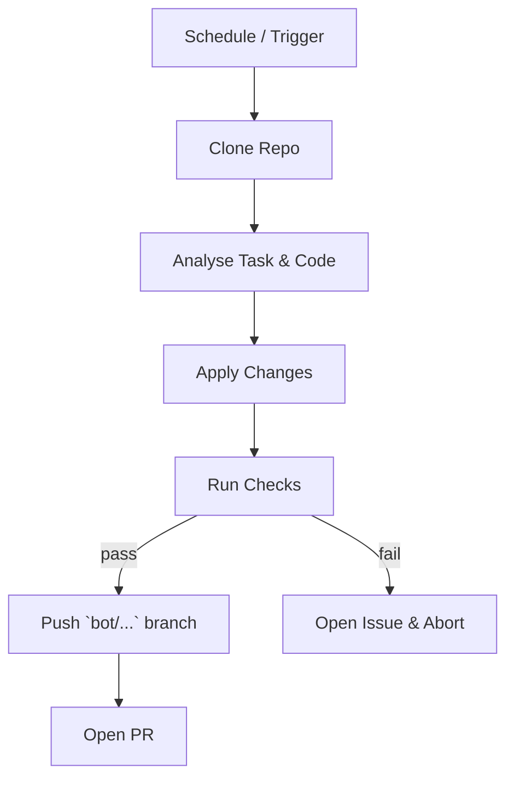

# AGENTS.md — Automated‑Maintenance **Rule Set**

This file is **not** a human‑oriented README.  It is an *executable specification* for any **LLM / Codex‑style autonomous agent** that is authorised to push branches or open pull‑requests against the `2006Scape` repository.  The rules below are *strict*; the agent must follow them literally or abort.

> **TL;DR** – If you are an LLM acting on this repo, obey every MUST, SHOULD, and MUST NOT below.  When in doubt, open an Issue titled `AI‑Clarification: <topic>` and wait for a maintainer.

---

## 0  Glossary

| Term        | Meaning                                                  |
| ----------- | -------------------------------------------------------- |
| **Agent**   | The autonomous program driven by an LLM ("you").         |
| **Task**    | A single logical change (e.g. format refactor, bug fix). |
| **MR / PR** | Merge‑request / pull‑request created by the agent.       |
| **Tick**    | One full run of the repository GitHub Action workflow.   |

---

## 1  Identity & Meta‑data

* The agent **MUST** identify itself with the commit/author `RuneBot <runebot@users.noreply.github.com>`.
* Each PR **MUST** carry the label `bot`.  The agent **MUST** set this label.
* The agent **MUST NOT** push directly to `main`; use a topic branch prefixed `bot/<task>/`.

Example branch: `bot/refactor/player-enums`.

---

## 2  Allowed Operations

The agent **MAY** perform **only** the following categories:

1. **Formatting** – run `mvn spotless:apply`.
2. **Refactor** – pure behaviour‑preserving changes (e.g. split 6k‑line classes, extract methods).
3. **Bug‑fix** – change that closes a GitHub issue with the `bug` label and reproduces in tests.
4. **Dependency update** – bump Maven or Docker base images **within same major version**.
5. **CI / workflow** – patch `.github/workflows/*.yml` for build health.

Any other class of change **MUST** be gated by a maintainer **Issue comment** containing `/allow-bot <task>`.

The agent **MUST NOT**:

* Touch any file under `cache/` or `assets/`.
* Commit Jagex‑owned proprietary content.
* Re‑write git history.
* Modify license headers.
* Introduce new runtime dependencies without maintainer permission.

---

## 3  Pre‑flight Checklist

Before opening a PR the agent **MUST** ensure:

1. **Build/Test strategy** – If this PR still relies on **Maven**, the network‑restricted sandbox cannot execute the usual `mvn verify`; therefore *unit and integration tests are skipped*.  If the PR switches to an **alternative runner that has no external dependencies** (e.g., a fat JUnit console jar), that runner **MUST** exit with status 0 and its command/output logged in the PR body.
2. `spotbugs:check` passes.
3. Modified lines are ≥ 80 % covered by unit/integration tests (Jacoco report).
4. Net line‑count change < 5 000 and touched files ≤ 10.
5. Branch is rebased onto latest `main`.
6. PR description follows the **template** in `.github/PULL_REQUEST_TEMPLATE/bot.md`.

If any item fails, abort and open an Issue instead of a PR.

---

## 4  Commit Message Format

Every commit **MUST** be single‑line summary ≤ 72 chars starting with `[BOT]`:

```
[BOT] chore(format): apply spotless to Player and Npc packages
```

If more detail is needed, use the PR body – not extra commit lines.

---

## 5  Code‑Style Canon

* Java 17 source/target.
* `google-java-format` (as configured by Spotless plugin) is the single source of truth.
* Max line length = 120.
* Prefer `enum` over magic int constants.
* No new global `static` mutable state.

Violating style **MUST** cause the agent to fail the pre‑flight build and abort.

---

## 6  Refactor Heuristics

An automated refactor **SHOULD**:

1. Split any class > 2 000 LOC.
2. Remove unused imports & dead code.
3. Convert duplicated literal IDs to shared enums/records.
4. Migrate legacy collections (`Vector`, `Hashtable`) to modern ones.
5. Preserve public API surface; mark breaking change PRs with `⚠️ breaking-change` in the title.

---

## 7  Testing Rules

* New logic **MUST** be accompanied by JUnit 5 tests.
* Tests **MUST NOT** depend on an external DB; use in‑memory Fakes.
* Each test class name **MUST** end with `Test`.
* The agent **SHOULD** generate property‑based tests when refactoring numerical formulas.

---

## 8  Security & Compliance

* Dependencies **MUST** have no known critical CVEs (`mvn org.owasp:dependency-check-maven:check`).
* Secrets detection (`trufflehog`) **MUST** pass.
* The agent **MUST** refuse to commit any file whose SHA‑256 matches the deny‑list in `.github/bot-denylist.txt`.

---

## 9  Rollback / Revert Protocol

If a PR authored by the agent is merged and afterwards fails on `main`:

1. The agent **MUST** open a revert PR within one tick.
2. Title format: `Revert: <original‑PR‑title>`.
3. Include a link to the failing CI run.

---

## 10  Escalation

When the agent encounters ambiguity:

* **First** – open an Issue tagged `needs‑maintainer`.
* **Wait** 24 hours of no maintainer response → ping `@Ddemon26` and halt.
* **NEVER** guess silently.

---

## 11  Self‑Update

The agent may update its own workflow **only** via a dedicated PR labeled `bot/self‑update` and must mention a human reviewer.

---

## 12  Lifecycle of a Typical Bot Change



---

## 13  De‑obfuscation & Safe Renaming

Poorly named identifiers such as `class204`, `method321`, or `anInt545` **MAY** be renamed **only** under these additional constraints.  These rules are *mandatory* because even a single accidental logic tweak can break client↔server protocol synchronisation.

> **Entire‑class rule** – When an agent works on a class for renaming, **every** ambiguous or non‑descriptive field, method, or nested type *inside that same class* **MUST** be renamed to an intentional, self‑documenting name during the **same PR**.  Partial renames are forbidden.
>
> **Public‑API cross‑check** – After renaming, the agent **MUST** perform a project‑wide sweep and triple‑check that **all references** (client *and* server‑side) to the renamed **public** members now use the new identifiers.  Any mismatch **MUST** abort the run.
>
> **Public‑API cross‑check** – After renaming, the agent **MUST** perform a project‑wide sweep and triple‑check that **all references** (client *and* server‑side) to the renamed **public** members now use the new identifiers.  Any mismatch **MUST** abort the run.
>
> **God‑class exception (≥ 10 000 LOC)** – When the target class is extremely large (roughly ≥ 10 000 lines), the rename **MUST** be delivered in a *sequence* of PRs:
>
> 1. **Phase A – Class shell rename.** PR #1 may rename **only** the class declaration itself and update every external reference.  Internal fields/methods may stay obfuscated for this step so the net diff and touched‑files count remain within Section 3 limits.
> 2. **Phase B – Incremental member cleanup.** Subsequent PRs should rename groups of ≤ 500 identifiers (or ≤ 2 000 modified LOC) per PR until the entire class is clear.
> 3. Each PR **MUST** still satisfy the pre‑flight checklist, *but test execution is waived if the project remains Maven‑based* (see Section 14). If an alternate test runner is provided, it **MUST** pass.
> 4. If any phase fails CI, the rollback protocol in Section 9 applies before continuing.
     >     (≥ 10 000 LOC)\*\* – When the target class is extremely large (roughly ≥ 10 000 lines), the rename **MUST** be delivered in a *sequence* of PRs:
> 5. **Phase A – Class shell rename.** PR #1 may rename **only** the class declaration itself and update every external reference.  Internal fields/methods may stay obfuscated for this step so the net diff and touched‑files count remain within Section 3 limits.
> 6. **Phase B – Incremental member cleanup.** Subsequent PRs should rename groups of ≤ 500 identifiers (or ≤ 2 000 modified LOC) per PR until the entire class is clear.
> 7. Each PR **MUST** still satisfy the pre‑flight checklist, pass offline CI, and update a progress checklist in its description (e.g., *“batch 2 of 5”*).
> 8. If any phase fails CI, the rollback protocol in Section 9 applies before continuing.

| Step                      | Mandatory Checks                                                                                                                                                                                                                                                                                                                                                                                                              |
| ------------------------- | ----------------------------------------------------------------------------------------------------------------------------------------------------------------------------------------------------------------------------------------------------------------------------------------------------------------------------------------------------------------------------------------------------------------------------- |
| **1  Scope**              | Operate on **a small batch of top‑level classes (preferably 2‑5) per PR**.  The branch name should follow `bot/rename/<batch-slug>` and the PR title **MUST** be `[BOT] refactor(rename): <ClassA>, <ClassB>, …`. <br><br>Every obfuscated identifier *inside each touched class* **MUST** be renamed in the same PR.  Avoid batches so large that they violate the pre‑flight limits in Section 3 or overwhelm human review. |
| **2  Dependency sweep**   | Before editing, grep for the old identifiers across the repo.<br>• Update **every reference** that uses the renamed public API (including tests and server modules).<br>• Do **NOT** touch unrelated logic or private helpers in other files.                                                                                                                                                                                 |
| **3  No‑logic guarantee** | After changes, run:<br>\`\`\`bash                                                                                                                                                                                                                                                                                                                                                                                             |

# ↪️ Compile‑only requirement (Maven builds)

javac \$(git ls-files '\*.java' | tr '
' ' ')  # ensure code still compiles

# ↪️ Alternate path — if a standalone test runner is provided, invoke it instead

# ./gradlew test --offline  or  java -jar tests-all.jar --scan-class-path

````<br>The diff **MUST** show *identifier changes only*; byte‑code instructions must remain byte‑for‑byte identical except for constant‑pool name entries. |
| **4  Triple‑check protocol**                                | a. Automated diff‑filter: abort if diff adds/removes anything but identifiers/comments.<br>b. Compile stage: full `verify` build (offline).<br>c. Runtime: spin up the Docker compose world, log in a test account, execute `/skills`, logout.  Abort if any exception or protocol mismatch occurs. |
| **5  Naming convention**                                    | • Classes → `UpperCamelCase`.<br>• Methods & fields → `lowerCamelCase`.<br>Names **MUST** convey intent – the agent **MUST first understand what each class, method, or variable actually does** and pick a clear, self‑describing identifier. Placeholder or purely positional names are forbidden. Aim for clarity over brevity (e.g., `ProjectileTrajectoryCalculator`). |
| **6  Follow‑up classes**                                    | If class *B* depends on renamed class *A*, perform the rename for *B's references* **in the same PR**, but do **not** begin renaming *B* itself (separate PR). |
| **7  Review artefacts**                                     | PR description **MUST** include:<br>• Old ⇢ new mapping table.<br>• Output of `git diff --stat`.<br>• Link to successful integration‑test log. |
| **8  Rollback readiness**                                   | Attach a one‑liner revert command in the PR body.  If post‑merge CI fails, Section 9 rollback applies. |

These safeguards are **critical** – any deviation **MUST** cause the agent to abort and open an Issue for human review.

---

## 14  Network Constraints & Offline Build Strategy

The CI runners for `2006Scape` execute inside a **Codex sandbox** with **no egress to the public Internet**.  Access to `repo.maven.apache.org`, Docker Hub, or any other external host is blocked unless routed through an internal MITM proxy.  To guarantee successful builds, the agent **MUST**:

1. **No offline Maven execution** – The sandbox blocks Maven Central and we do **not** maintain an offline mirror.  Therefore any PR that still uses Maven **MUST skip test execution**.  Compilation checks (e.g., `javac`) are still required.  If the PR adds a self‑contained test runner (fat jar, Gradle offline build, etc.), that runner **MUST** be executed and pass.

2. **Avoid fetching new artifacts** – Any change that introduces a dependency **NOT** present in the offline cache **MUST** abort and open an Issue requesting human approval.
3. **Export proxy & CA variables** for auxiliary tools (curl, npm, gradle):
   ```bash
   export http_proxy="http://proxy:8080"
   export https_proxy="$http_proxy"
   export no_proxy="localhost,127.0.0.1,::1"
   export SSL_CERT_FILE="/usr/local/share/ca-certificates/envoy-mitmproxy-ca-cert.crt"
   export REQUESTS_CA_BUNDLE="$SSL_CERT_FILE"
   export NODE_EXTRA_CA_CERTS="$SSL_CERT_FILE"
````

4. **Pre‑flight verification** (Section 3) **MUST** be executed in offline mode\*\*. Passing online locally is insufficient.
5. **Startup‑script edits** – If the agent modifies any Dockerfile or CI `startup.sh`, it **MUST** ensure the script installs Maven, applies the proxy/CA vars above, and unpacks the offline repo before running tests.

Failure to respect these constraints will cause CI to fail in the sandbox even if the agent passes tests locally.

---

*End of strict agent ruleset.*
