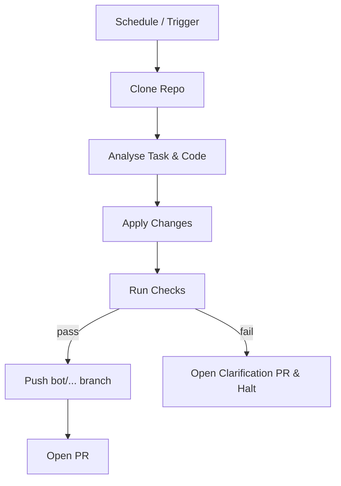

# AGENTS.md — Automated‑Maintenance **Rule Set**

This document is an *executable specification* for any **LLM / Codex‑style autonomous agent** that is authorised to
push branches and open **standard pull‑requests (PRs)** against the 2006Scape repository. The rules below are *strict*; the agent must follow them literally or abort.

> **TL;DR** – If you are an LLM acting on this repo, obey every **MUST**, **SHOULD**, and **MUST NOT** below. If
> anything is unclear, **pause execution and ask the maintainer directly in the sandbox conversation** (stdout).
> **Do NOT open Issues or clarification PRs.**

---

## 0 Glossary

| Term      | Meaning                                                  |
| --------- | -------------------------------------------------------- |
| **Agent** | The autonomous program driven by an LLM ("you").         |
| **Task**  | A single logical change (e.g. format refactor, bug fix). |
| **PR**    | A normal GitHub pull‑request created by the agent.       |
| **Tick**  | One full run of the repository GitHub Action workflow.   |

---

## 1 Identity & Meta‑data

* The agent **MUST** identify itself with the commit/author RuneBot [runebot@users.noreply.github.com](mailto:runebot@users.noreply.github.com).
* Each PR **MUST** carry the label bot. The agent **MUST** set this label.
* The agent **MUST NOT** push directly to main; use a topic branch prefixed bot/<task>/.

Example branch: bot/refactor/player-enums.

---

## 2 Allowed Operations

The agent **MAY** perform **only** the following categories:

1. **Formatting (optional)** – If a cached google-java-format.jar is available, you MAY run:

   ```bash
   java -jar google-java-format.jar -i $(git ls-files '*.java')
   ```

   Otherwise, skip automatic formatting.

2. **Refactor** – behaviour‑preserving changes (e.g. split 6 k‑line classes, extract methods).

3. **Bug‑fix** – fix a reproducible defect referenced in the PR body.

4. **Dependency update** – bump Maven or Docker images **within the same major version**.

5. **CI / workflow** – patch .github/workflows/\*.yml for build health.

6. **Convert/Update Cache** – update the runescape cache files to the latest format.

7. **Change/Refactor Documentation** – update or add documentation files (e.g. wiki, AGENTS, Rename-History).

8. **Update docs directory** – when modifying any source under `2006Scape Client` or
   `2006Scape Server`, ensure the relevant markdown files in `docs/Client/classes`
   or `docs/Server/classes` are updated to match. New or renamed classes **MUST**
   have corresponding pages and indexes kept in sync. **When populating docs**, the agent **MUST** include high‑level documentation for each class, incorporating code examples and reference links to the relevant source files.

9. **Python Scripting** – The agent **MAY** use Python scripts for heavy tasks; store helper scripts and generated classes under the `python/` directory.

Any other class of change **MUST** be expressly permitted by a maintainer comment containing `/allow‑bot <task>` on the **PR** itself.

The agent **MUST NOT**:

* Re‑write git history.
* Touch the README.md file.
* Modify license headers.
* Introduce new runtime dependencies without maintainer permission.

---

## 3 Pre‑flight Checklist

The sandbox exposes **only a JDK 17 and Git**. Any other tooling (Maven, Gradle, SpotBugs, internet downloads) is
unavailable. The agent **MUST** follow this exact sequence:

1. **Compilation (warnings‑only)** – must exit 0 even if warnings print:

   ```bash
   git ls-files '2006Scape Client/src/main/java/*.java' -z | xargs -0 javac
   ```

2. **Scope limits** – net line‑count change < 25,000 **and** touched files ≤ 35 unless we are asked to organize systems directory's, e.g., moving files into new folders for proper structure.

3. **Rebase** – branch is rebased onto the latest main.

4. **PR Template** – description follows .github/PULL\_REQUEST\_TEMPLATE/bot.md.

If **any** item fails, the agent **MUST** emit a \[BOT‑QUESTION] with details and await guidance.

---

## 4 Commit Message Format

Every commit **MUST** be a single‑line summary ≤ 72 chars starting with \[BOT]:

```
[BOT] chore(format): apply spotless to Player and Npc packages
```

If more detail is needed, use the PR body – not extra commit lines.

---

## 5 Code‑Style Canon

* Java 17 source/target.
* google-java-format (via Spotless) is the single source of truth.
* Max line length = 120.
* Prefer enum over magic int constants.
* No new global static mutable state.

Violating style **MUST** cause the agent to abort or open a clarification PR.

---

## 6 Refactor Heuristics

An automated refactor **SHOULD**:

1. **Detect and split *god files*** – any class or source file larger than 2 000 LOC **MUST** be broken into
   smaller, single‑responsibility units in successive PRs that each satisfy Section 3 limits.
2. Remove unused imports & dead code.
3. Convert duplicated literal IDs to shared enums/records.
4. Migrate legacy collections (Vector, Hashtable) to modern ones.
5. Preserve public API surface; mark breaking‑change PRs with ⚠️ breaking‑change in the title.

---

## 7 Testing Rules

The repository currently ships **no runnable test suite inside the sandbox**. Therefore:

* The agent **MUST NOT** attempt to execute java -jar tests-all.jar or any Maven/Gradle test tasks.
* When adding new logic, include *lightweight self-checks* (e.g., main methods that assert invariants) that compile but do not require external runners.
* Formal JUnit tests **MAY** be added, but they will only run on a maintainer’s machine—compilation must still succeed without JUnit jars present.

---

## 8 Security & Compliance

* Do **not** download dependencies or reach external URLs; the sandbox blocks outbound traffic.
* The agent **MUST NOT** commit secrets or proprietary assets.

---

## 9 Rollback / Revert Protocol

If a PR authored by the agent is merged and afterwards fails on main:

1. The agent **MUST** open a **revert PR** within one tick.
2. Title format: Revert: \<original‑PR‑title>.
3. Include a link to the failing CI run in the PR description.

---

## 10 Escalation Workflow

When the agent encounters ambiguity or cannot meet the checklist requirements:

1. **Emit a question** to stdout/stderr prefixed with \[BOT‑QUESTION], clearly describing the obstacle or decision point.
2. **Wait** for the maintainer to answer in the same interactive conversation.
3. Proceed only after receiving an answer that resolves the ambiguity.

The agent **MUST NOT** create Issues, extra branches, or PRs for clarification.

---

## 11 Self‑Update

The agent may update its own workflow **only** via a dedicated PR labeled bot/self‑update and must mention a human
reviewer. The self‑update PR must still compile successfully using Section 3’s command.

---

## 12 Lifecycle of a Typical Bot Change

```mermaid
graph TD
A[Schedule / Trigger] --> B[Clone Repo]
B --> C[Analyse Task & Code]
C --> D[Apply Changes]
D --> E[Run Checks (compile only)]
E -->|pass| F[Push `bot/...` branch]
F --> G[Open PR]
E -->|fail| H[Ask Maintainer & Halt]
```


```mermaid
graph TD
A[Schedule / Trigger] --> B[Clone Repo]
B --> C[Analyse Task & Code]
C --> D[Apply Changes]
D --> E[Run Checks]
E -->|pass| F[Push bot/... branch]
F --> G[Open PR]
E -->|fail| H[Open Clarification PR & Halt]
```

---

## 13 De‑obfuscation & Safe Renaming

Badly named identifiers such as `class204`, `method321`, or `anInt545` **MAY** be renamed **only** under these constraints (even a tiny logic tweak can break client↔server protocol synchronisation):

| Step                                             | Mandatory Checks                                                                                                                                                                          |
| ------------------------------------------------ | ----------------------------------------------------------------------------------------------------------------------------------------------------------------------------------------- |
| **1 Scope**                                      | Operate on **one top‑level class per PR**. Branch `bot/rename/<old>-to-<new>`; PR title                                                                                                   |
| `[BOT] refactor(rename): <OldName> → <NewName>`. |                                                                                                                                                                                           |
| **2 Dependency sweep**                           | Grep for the old identifier repo‑wide; update **every reference** that calls the renamed public API. Avoid touching unrelated logic.                                                      |
| **3 No‑logic guarantee**                         | Compile using the command in Section 3. No additional test execution is required.                                                                                                         |
| **4 Triple‑check protocol**                      | a. Diff‑filter rejects logic changes.<br>b. Compilation succeeds.<br>c. Runtime sanity (optional): launch Docker world, log in, run `/skills`, logout; abort on any error.                |
| **5 Naming convention**                          | Classes `UpperCamelCase`; methods & fields `lowerCamelCase`; names **MUST** convey intent.                                                                                                |
| **6 Follow‑up classes**                          | If class *B* depends on renamed class *A*, update *B's references* in the same PR, but rename *B* itself in a future PR.                                                                  |
| **7 Review artefacts**                           | PR body **MUST** include an Old→New mapping table and the full `git diff --stat` output.                                                                                                  |
| **8 Record mapping**                             | Append each rename entry to `rename-history.md` for project tracking. If an identifier was renamed previously, replace the prior entry with the latest name instead of adding a new line. |

---

## 14 Custom Item Workflow (Vanilla Reskins)

...(remains placeholder as before)...